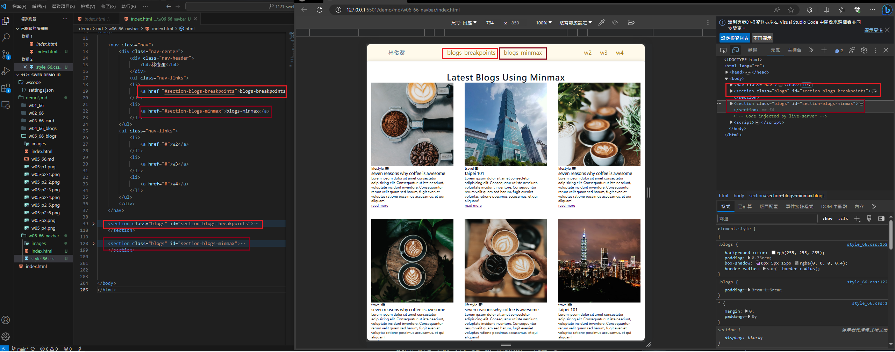
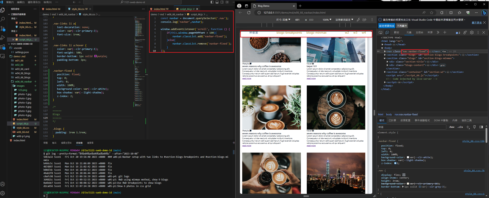
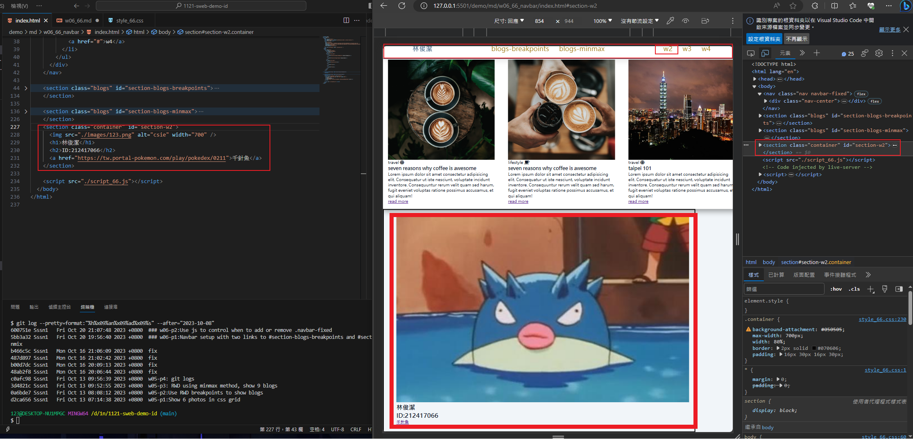
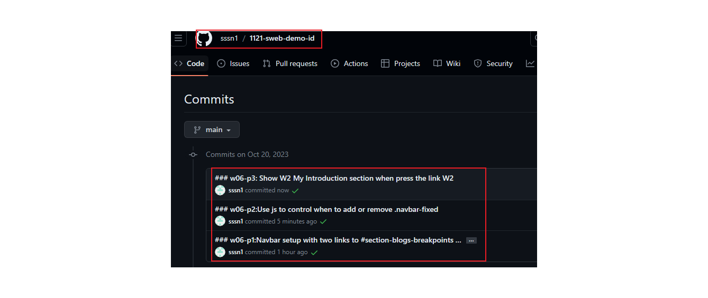

[My github Repo URL](https://github.com/sssn1/1121-sweb-demo-id.git)

[My Vercel URL]()


### w06-p1:Navbar setup with two links to #section-blogs-breakpoints and #section-blogs-minmix

```
5bb3a32 Sssn1   Fri Oct 20 19:56:40 2023 +0800  ### w06-p1:Navbar setup with two links to #section-blogs-breakpoints and #section-blogs-minmix
```
### w06-p2:Use js to control when to add or remove .navbar-fixed

```
600751e Sssn1   Fri Oct 20 21:07:48 2023 +0800  ### w06-p2:Use js to control when to add or remove .navbar-fixed
```
### w06-p3: Show W2 My Introduction section when press the link W2

```
38e77e6 Sssn1   Fri Oct 20 21:12:25 2023 +0800  ### w06-p3: Show W2 My Introduction section when press the link W2
```

### w06-p4:W6 git logs
