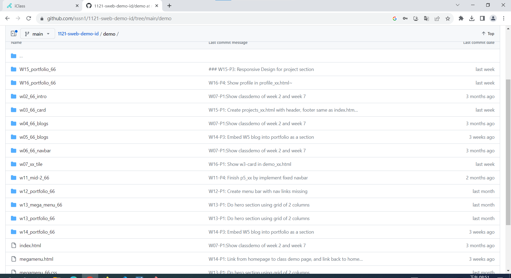
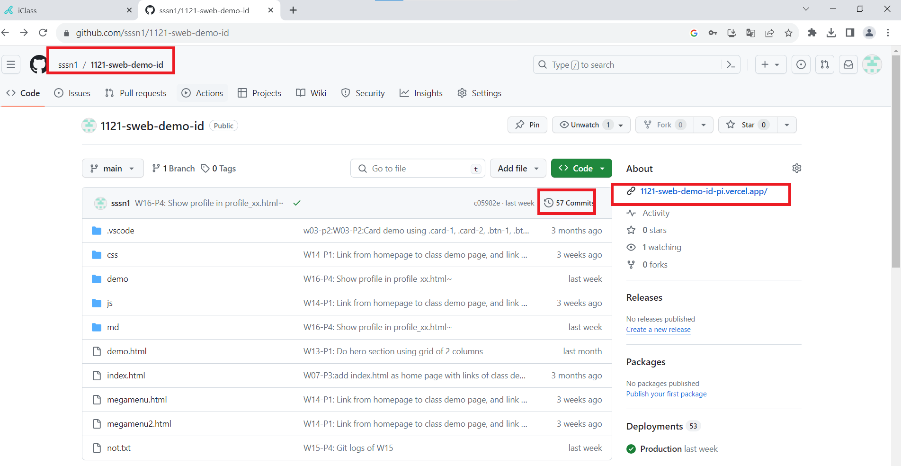
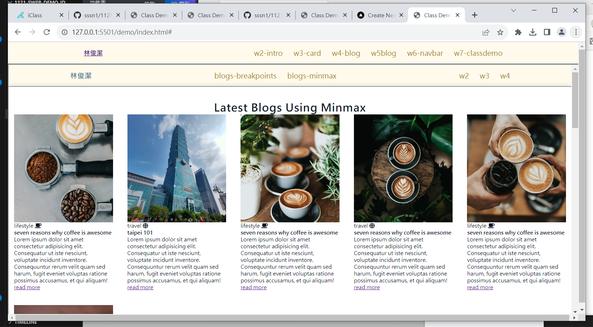
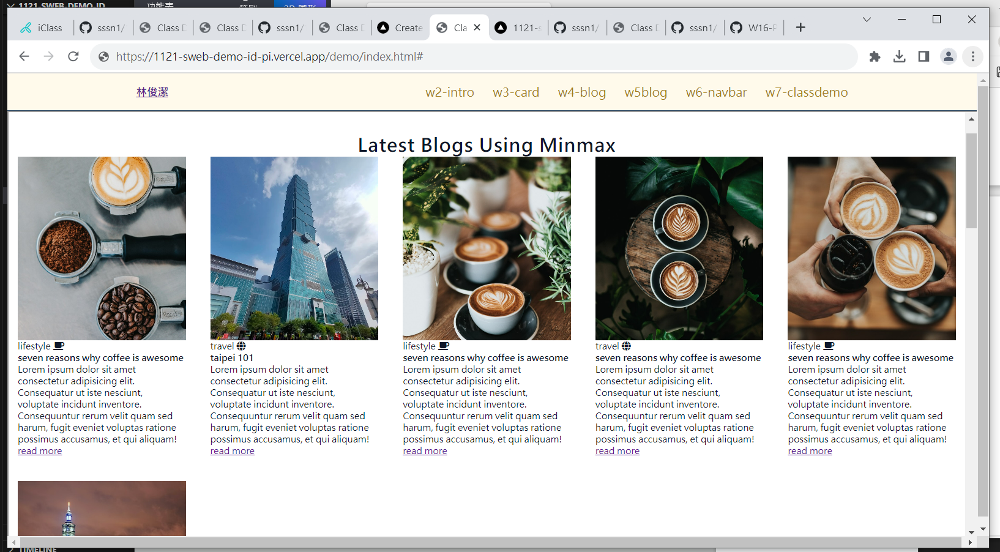
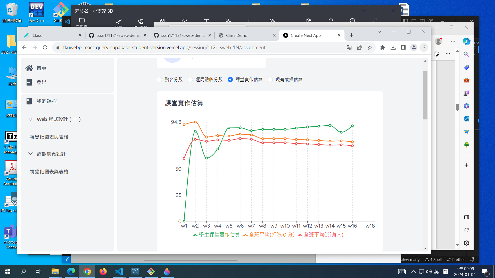
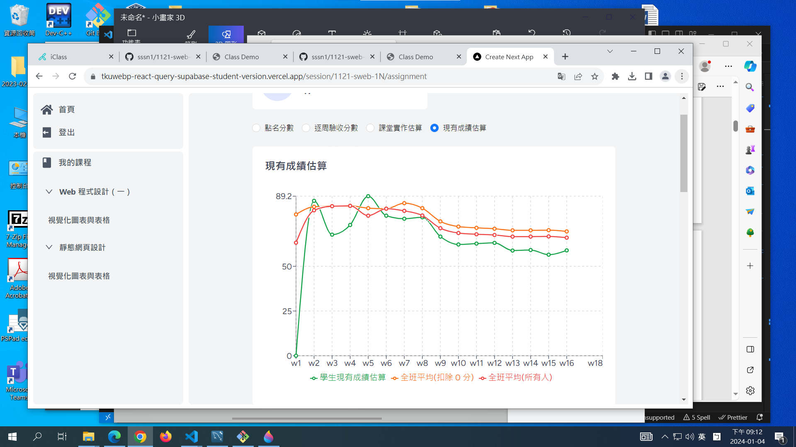
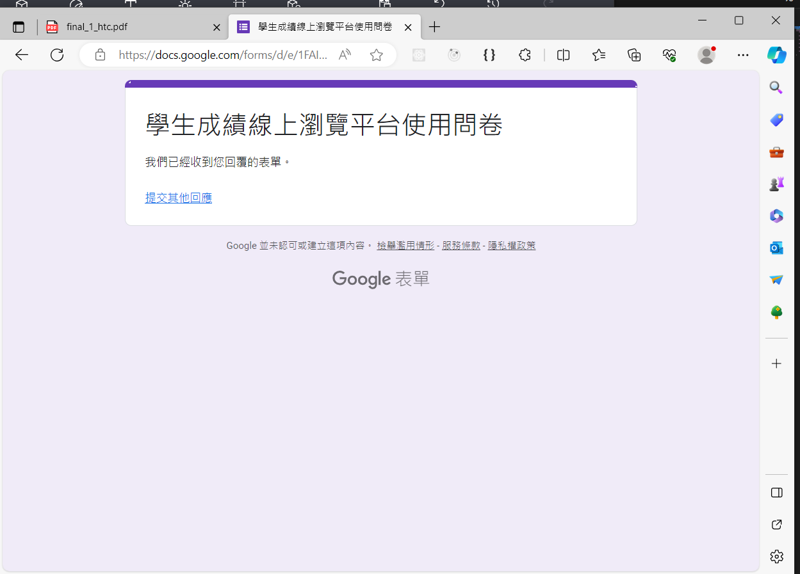
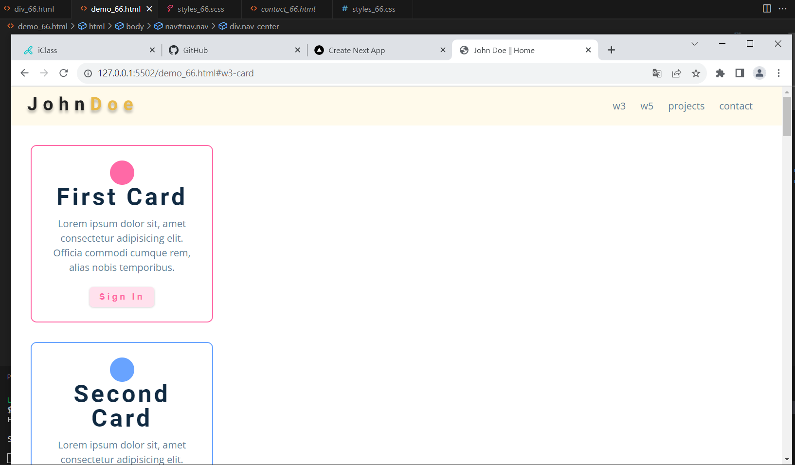
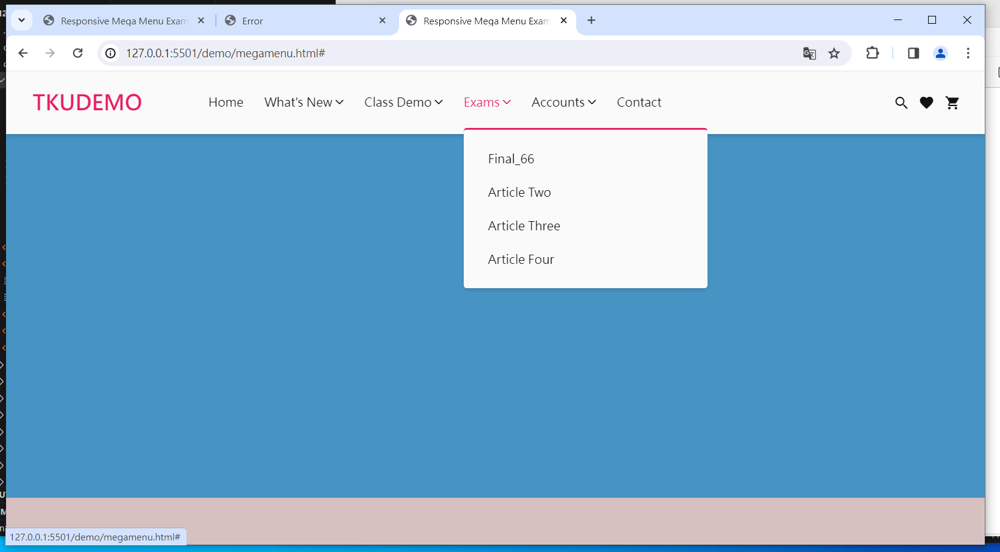

# (10%) 靜態網頁 1N 期末上機考-1 -- 開放網路

##### final-1 總分: 50 分

##### 2024-1-3, at E201

#### Note:

1. 請不要發揮同學愛，作弊雙方除了本次考試 0 分外，平常分數另扣 20 分。
2. iClass 上請繳交 final_1_xx.md, final_1_xx.pdf，還有 src_xx.zip
3. 請直接將答案寫在 final_1_xx.md 上，要實作的部分放在 final_1_htc.pdf 上，請依照老師實作的圖片在你自己的 Github repo, Vercel 上實作
4. 跟期末考相關的檔案及目錄名稱有 xx 時，必須要改成學號後 2 碼，沒有修改時，會視違犯情況扣分。
5. 每一張圖片要有機房左側背景，要有你的學號，圖片標註要跟老師所標註的類似。違者會依情節扣分。
6. 請自評分數，將每一題的 ? 填入分數，沒有填者，不會批改，以 0 分計算。

##### Your (Name, ID): (?, ?)

##### P1 (20%) -- 基本題

- P1-1 (3%): ? 分
- P1-2 (3%): ? 分
- P1-3 (3%): ? 分
- P1-4 (3%): ? 分
- P1-5 (3%): ? 分
- P1-6 (5%): ? 分

##### P2(30%) -- React & Supabase

- P2-1 (6%): ? 分
- P2-2 (6%): ? 分
- P2-3 (8%): ? 分
- P2-4 (10%): ? 分

##### 總分: ? 分

---

## (20%) P1: 基本題

#### (3%) P1-1: Show Your Github Repo page with all class demos

[My Github Repo URL](https://github.com/sssn1/1121-sweb-demo-id)


#### Your Answer



#### (3%) P1-2: Show Your Git Commits & Vercel Link


#### Your Answer



#### (3%) P1-3: 在 local and Vercel，顯示 W6 navbar demo

##### => local


##### => Vercel，請注意網址列，是直接連入，沒有透過選單


#### Your Answer

##### => local



##### => Vercel，請注意網址列，是直接連入，沒有透過選單



#### (3%) P1-4: 請登入學生成績線上瀏覽平台，並印出你的課堂實作估算統計圖表

[學生成績線上瀏覽平台](https://tkuwebp-react-query-supabase-student-version.vercel.app/login)


#### Your Answer



#### (3%) P1-5: 請登入學生成績線上瀏覽平台，並印出你的現有成績估算統計圖表


#### Your Answer



#### (5%) P1-6: 請填寫問卷，送出成功後請截圖如下，截圖右下角要有截圖時間。本問卷不計名，不須登入 Google，不會影響到你的成績，請如實填寫，主要是提供研究用途。

[問卷表單連結](https://forms.gle/HBeioqqcB8eAkgLs5)


#### Your Answer



---

## (30%) P2: html, scss, responsive

#### (6%) P2-1: 請修改老師提供的 demo_xx.html，選單產生 w3-card-xx, w5-blogs-xx，分別連到 w3-card-xx, w5-blogs-xx 上，w5-blogs-xx 要能顯現響應式網頁

##### => browser, 點選 w5-blogs-xx，呈現每行 4 個 blogs


##### Your Answer:


##### => browser, 點選 w3-card-xx


##### Your Answer:



---

#### (6%) P2-2: 請針對 demo_xx.html 內的 blogs 圖片，利用 breakpoints 斷點做響應式如下：

##### Your Answers:

##### => <500px 每行 1 張圖片，請以 498px 測試，並截圖如下：


##### => 500px~700px 每行 2 張圖片，請以 600px 測試，並截圖如下：


##### => 700px~900px 每行 3 張圖片，請以 800px 測試，並截圖如下：


##### => 900px~1100px 每行 4 張圖片，請以 1000px 測試，並截圖如下：


##### => 1100px~1300px 每行 5 張圖片，請以 1200px 測試，並截圖如下：


##### => 1300px 以上 每行 6 張圖片，請以 1400px 測試，並截圖如下：


##### => 跟響應式有關的 css


---

#### (8%) P2-3: 請加入選單 Final_xx, Demo_xx, Contact_xx, Resume_xx 要能在 index.html, final_xx.html, demo_xx.html, resume_xx.html 這些 html 檔案中互相連接，sidebar 選單也要能夠互相連接

##### => final_xx.html nav 顯示


##### => final_xx.html sidebar 顯示


##### Your Answers:

##### => final_xx.html nav 顯示


##### => final_xx.html sidebar 顯示


##### => final_xx.html, nav and sidebar code，只要提供一個 final_xx.html 就可以，不必顯示其他三個 html code


##### => demo_xx.html nav 顯示


##### => demo_xx.html sidebar 顯示


##### => contact_xx.html nav 顯示


##### => contact_xx.html sidebar 顯示


---

#### (10%) P2-4: make a link in megamenu_xx.html, and put it to Vercel

#### 請將本考試目錄 final-2-closed 複製一份放入你的 Github demo 目錄下，改名 w17_final_xx，並在 demo 下的 megamenu_xx.html 建立一個項目 w17_final_xx，點選後可以執行 final_xx.html。

##### => local


##### Your Answer:


##### => Vercel


##### Your Answer:




##### => git log


```
39facd9 htchung Thu Jan 4 17:11:44 2024 +0800   P2-4: make a link in megamenu_xx.html, and put it to Vercel
```

##### Your Answer:

```
git log
```


