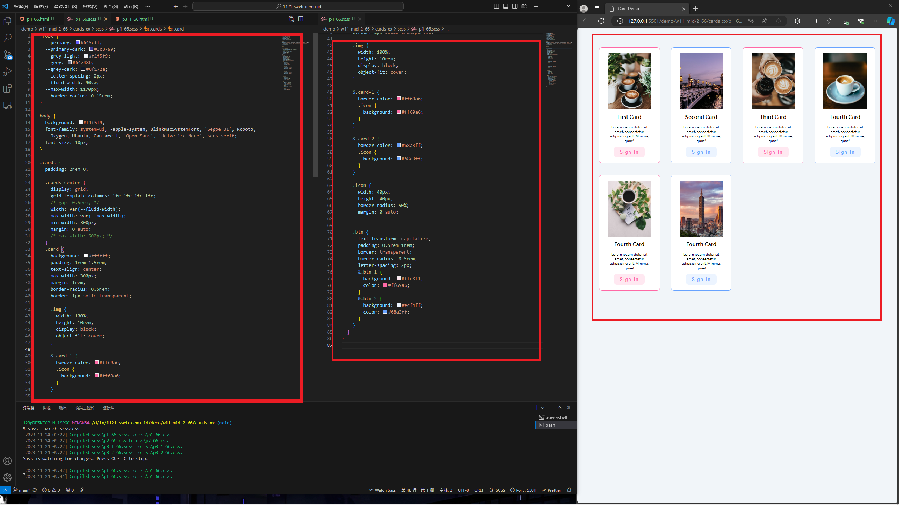
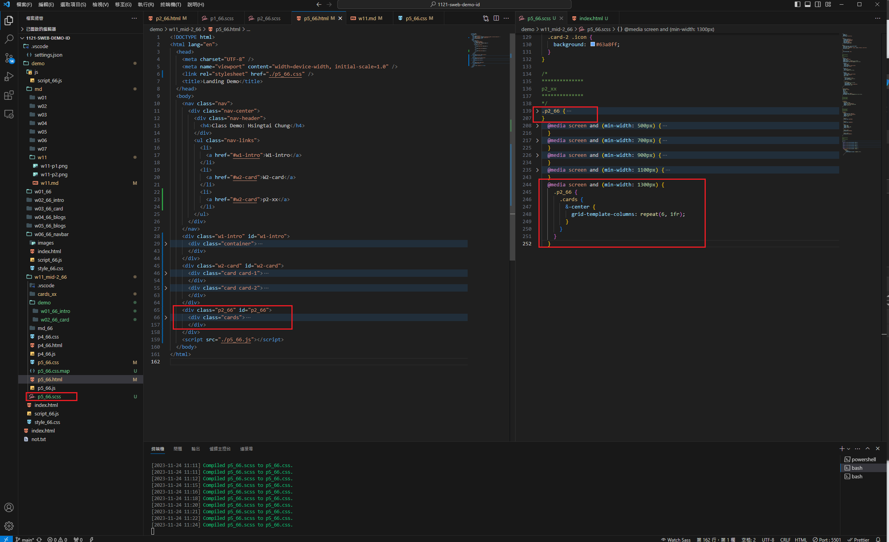
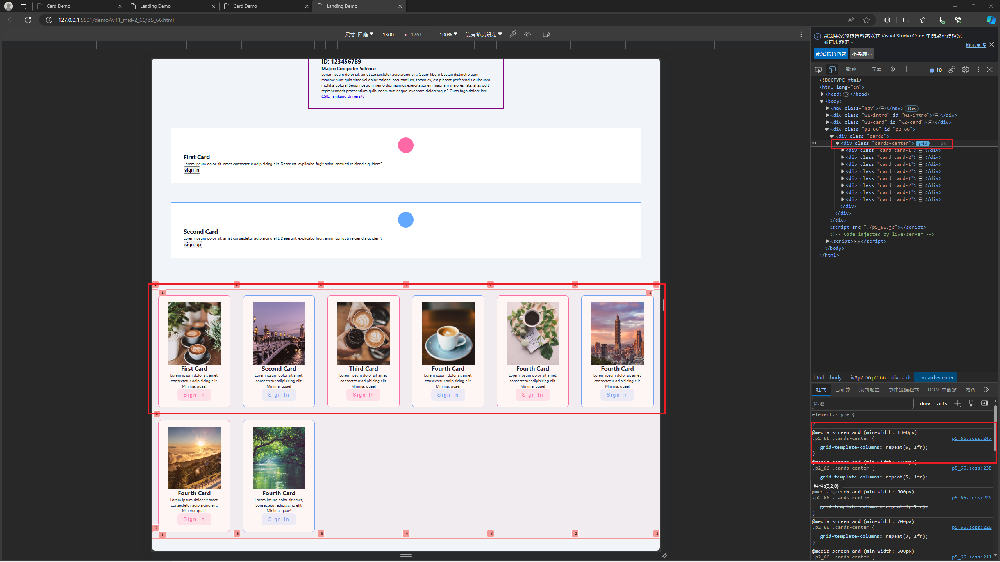
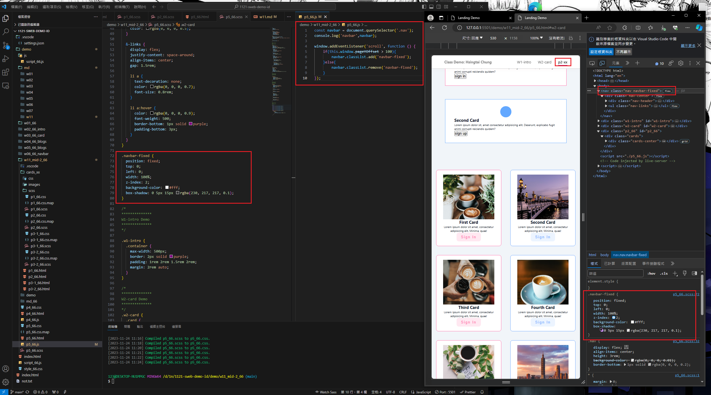
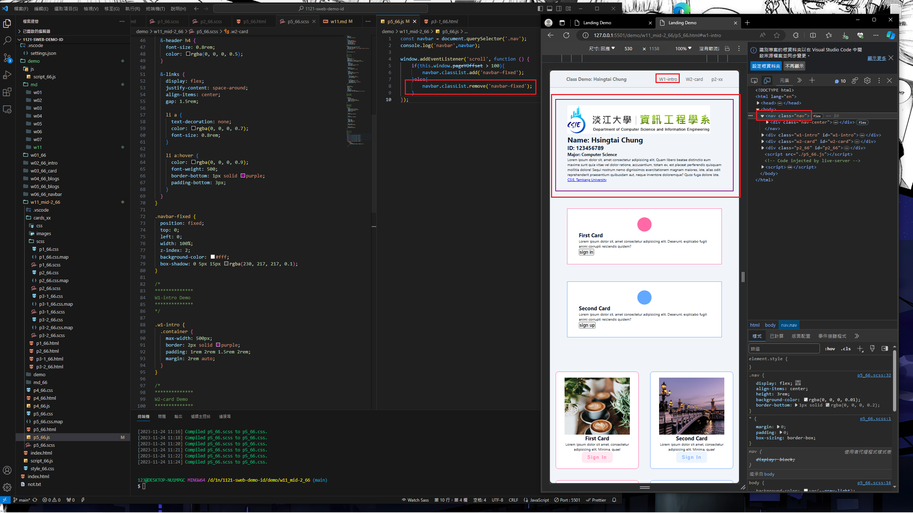
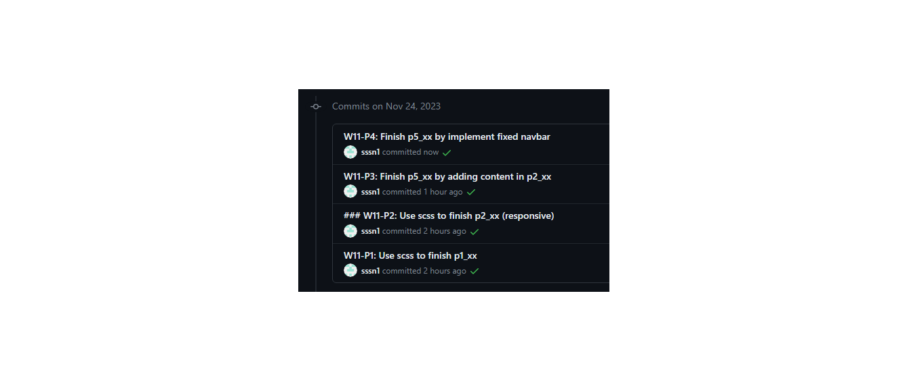

[My github Repo URL](https://github.com/sssn1/1121-sweb-demo-id.git)

### W11-P1: Use scss to finish p1_xx


```
d1eefec Sssn1   Fri Nov 24 09:52:13 2023 +0800  W11-P1: Use scss to finish p1_xx
```

### W11-P2: Use scss to finish p2_xx (responsive)
 


```
2a9ad3c Sssn1   Fri Nov 24 10:15:53 2023 +0800  ### W11-P2: Use scss to finish p2_xx (responsive)
```
### W11-P3: Finish p5_xx by adding content in p2_xx
 

 


```
e71be38 Sssn1   Fri Nov 24 11:35:25 2023 +0800  W11-P3: Finish p5_xx by adding content in p2_xx
```

### W11-P4: Finish p5_xx by implement fixed navbar
 

 


### W11-P5: W11 git logs
 

```
343dce4 Sssn1   Fri Nov 24 12:47:07 2023 +0800  W11-P5: W11 git logs
```