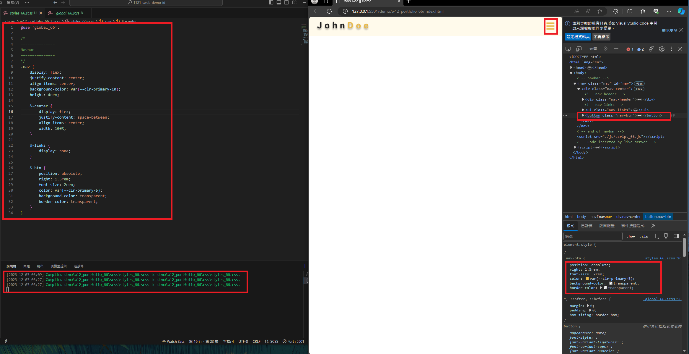
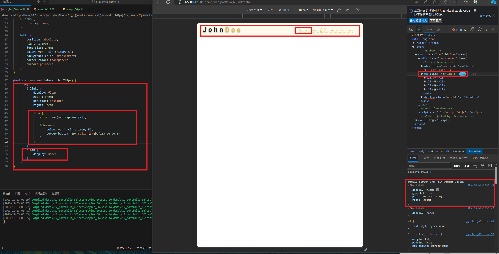
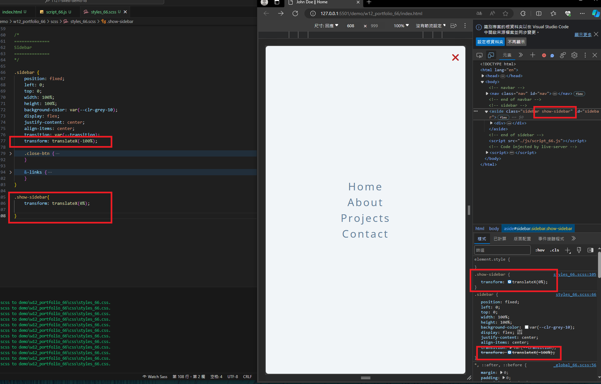
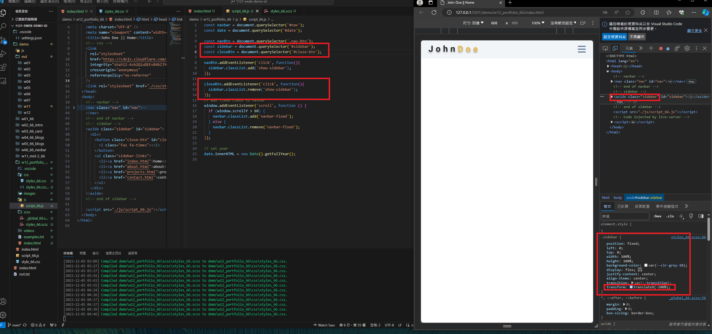
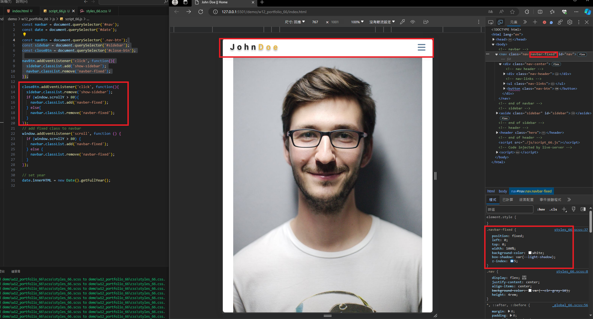
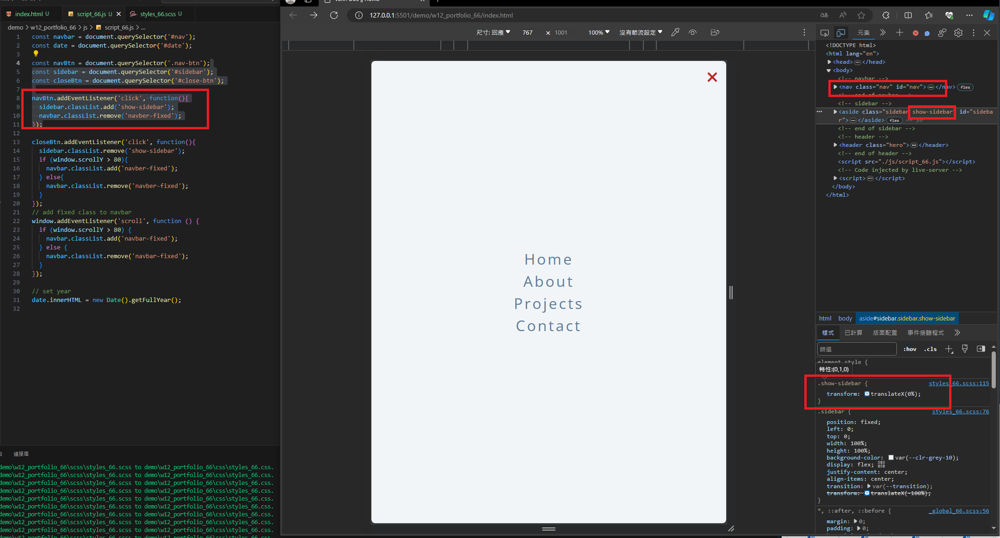
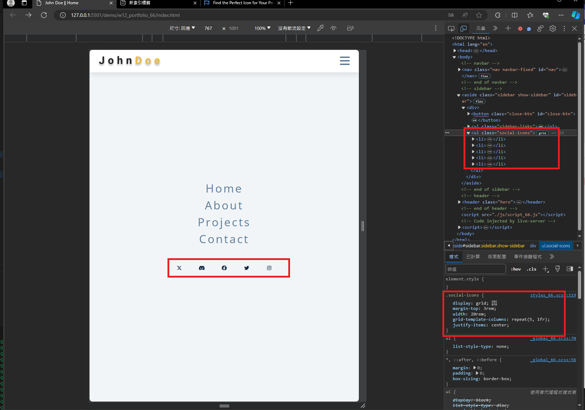
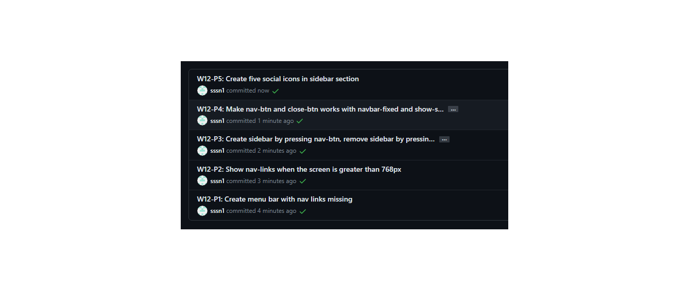

[My github Repo URL](https://github.com/sssn1/1121-sweb-demo-id.git)

### W12-P1: Create menu bar with nav links missing
 

```
79fafe5 Sssn1   Sun Dec 3 05:40:44 2023 +0800   W12-P1: Create menu bar with nav links missing
```

### W12-P2: Show nav-links when the screen is greater than 768px
 

```
eac0b43 Sssn1   Sun Dec 3 05:42:00 2023 +0800   W12-P2: Show nav-links when the screen is greater than 768px
```

### W12-P3: Create sidebar by pressing nav-btn, remove sidebar by pressing close-btn
 

 

```
f1ab641 Sssn1   Sun Dec 3 05:43:14 2023 +0800   W12-P3: Create sidebar by pressing nav-btn, remove sidebar by pressing close-btn
```

### W12-P4: Make nav-btn and close-btn works with navbar-fixed and show-sidebar
 

 


```
dda3d21 Sssn1   Sun Dec 3 05:44:09 2023 +0800   W12-P4: Make nav-btn and close-btn works with navbar-fixed and show-sidebar
```

### W12-P5: Create five social icons in sidebar section
 


```
a38cb98 Sssn1   Sun Dec 3 05:45:04 2023 +0800   W12-P5: Create five social icons in sidebar section
```

### W12-P6: W12 git logs
 


```
2ea6bf7 Sssn1   Sun Dec 3 05:48:15 2023 +0800   W12-P6: W12 git logs
a38cb98 Sssn1   Sun Dec 3 05:45:04 2023 +0800   W12-P5: Create five social icons in sidebar section
dda3d21 Sssn1   Sun Dec 3 05:44:09 2023 +0800   W12-P4: Make nav-btn and close-btn works with navbar-fixed and show-sidebar
f1ab641 Sssn1   Sun Dec 3 05:43:14 2023 +0800   W12-P3: Create sidebar by pressing nav-btn, remove sidebar by pressing close-btn
eac0b43 Sssn1   Sun Dec 3 05:42:00 2023 +0800   W12-P2: Show nav-links when the screen is greater than 768px
79fafe5 Sssn1   Sun Dec 3 05:40:44 2023 +0800   W12-P1: Create menu bar with nav links missing
```