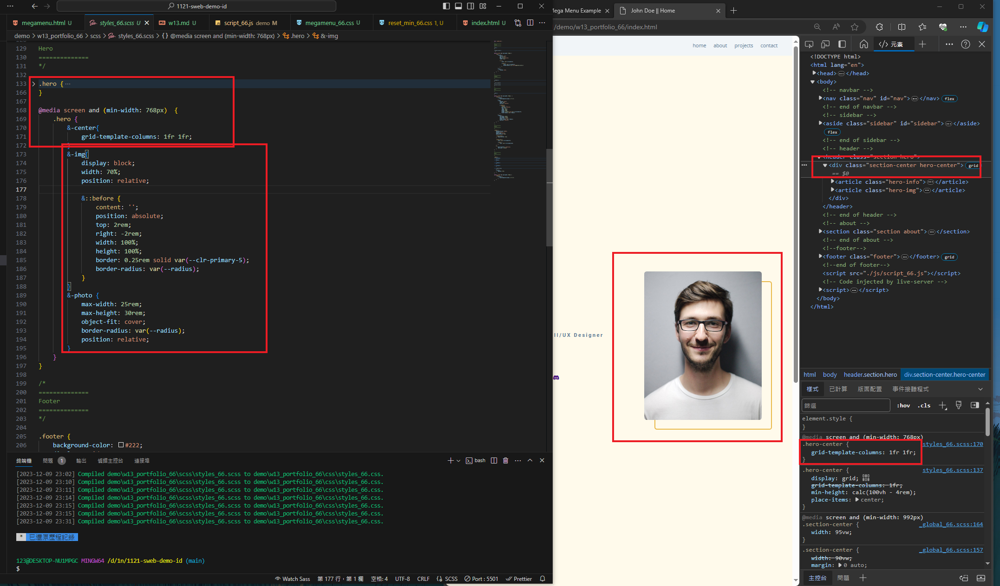
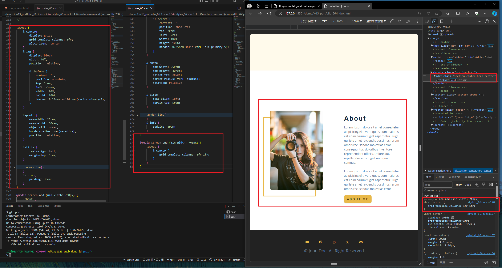
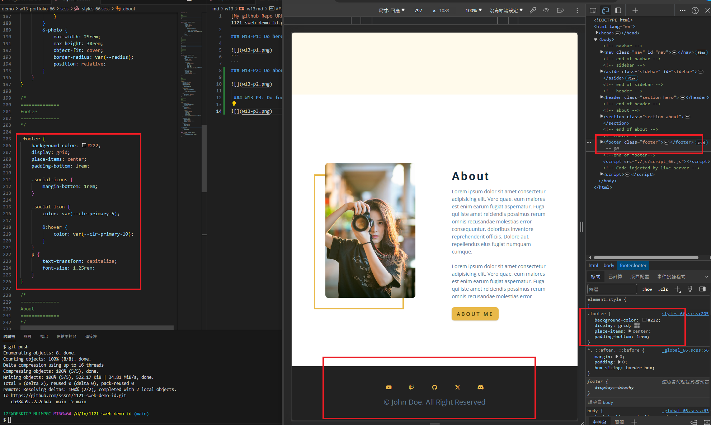
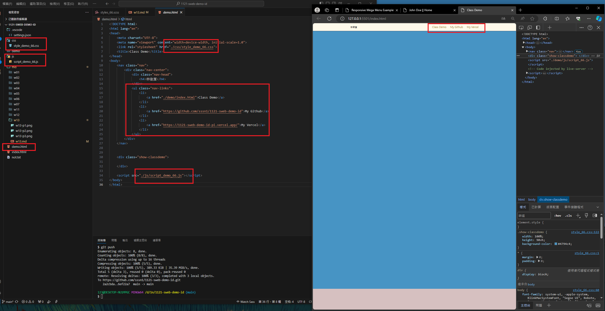
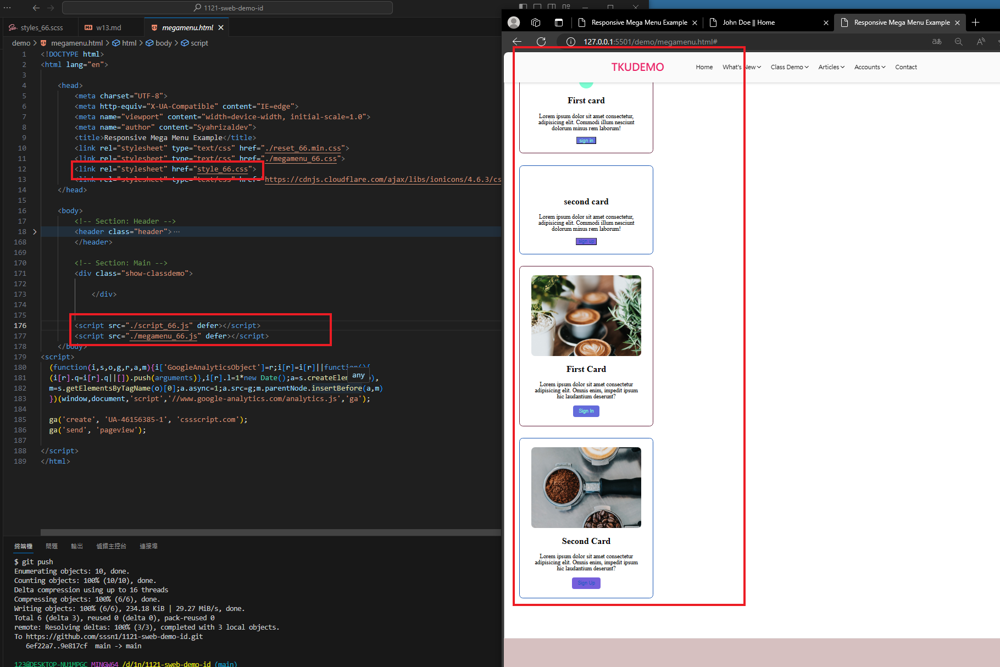
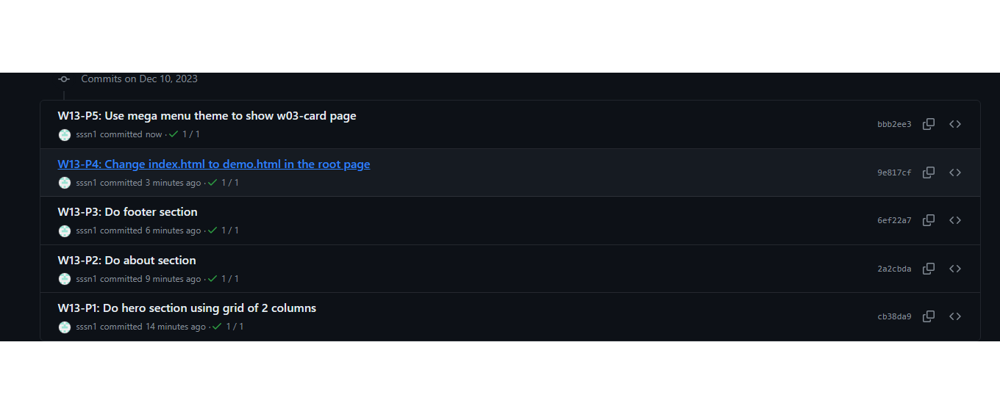

[My github Repo URL](https://github.com/sssn1/1121-sweb-demo-id.git)

### W13-P1: Do hero section using grid of 2 columns
 

```
cb38da9 Sssn1   Sun Dec 10 05:05:17 2023 +0800  W13-P1: Do hero section using grid of 2 columns
```
### W13-P2: Do about section
 

```
2a2cbda Sssn1   Sun Dec 10 05:10:20 2023 +0800  W13-P2: Do about section
```
 ### W13-P3: Do footer section
 

```
6ef22a7 Sssn1   Sun Dec 10 05:13:12 2023 +0800  W13-P3: Do footer section
```
### W13-P4: Change index.html to demo.html in the root page
 

```
9e817cf Sssn1   Sun Dec 10 05:15:43 2023 +0800  W13-P4: Change index.html to demo.html in the root page
```
### W13-P5: Use mega menu theme to show w03-card page
 

```
bbb2ee3 Sssn1   Sun Dec 10 05:19:02 2023 +0800  W13-P5: Use mega menu theme to show w03-card page
```
### W13-P6: W13 git logs
 

```
1d04372 Sssn1   Sun Dec 10 05:21:41 2023 +0800  W13-P6: W13 git logs
bbb2ee3 Sssn1   Sun Dec 10 05:19:02 2023 +0800  W13-P5: Use mega menu theme to show w03-card page
9e817cf Sssn1   Sun Dec 10 05:15:43 2023 +0800  W13-P4: Change index.html to demo.html in the root page
6ef22a7 Sssn1   Sun Dec 10 05:13:12 2023 +0800  W13-P3: Do footer section
2a2cbda Sssn1   Sun Dec 10 05:10:20 2023 +0800  W13-P2: Do about section
cb38da9 Sssn1   Sun Dec 10 05:05:17 2023 +0800  W13-P1: Do hero section using grid of 2 columns
```