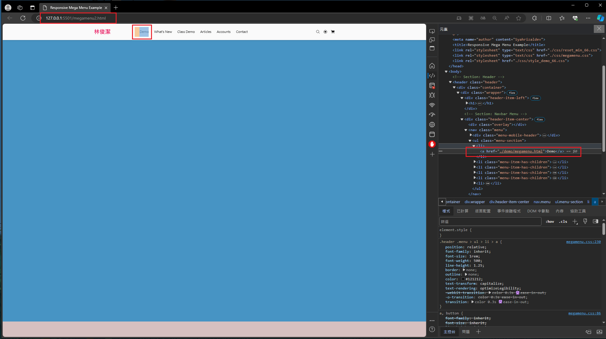
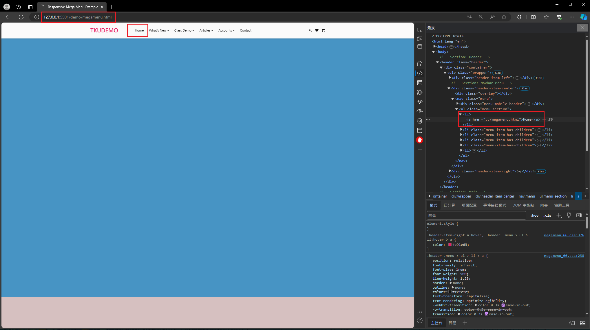
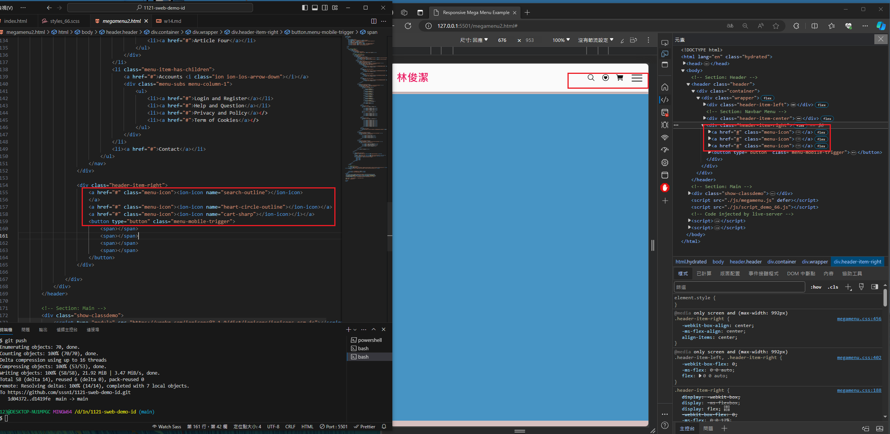
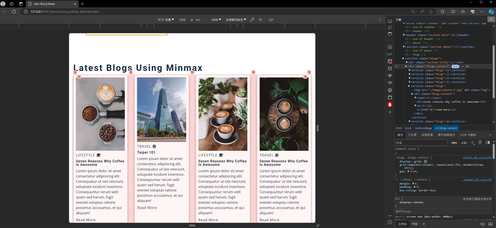
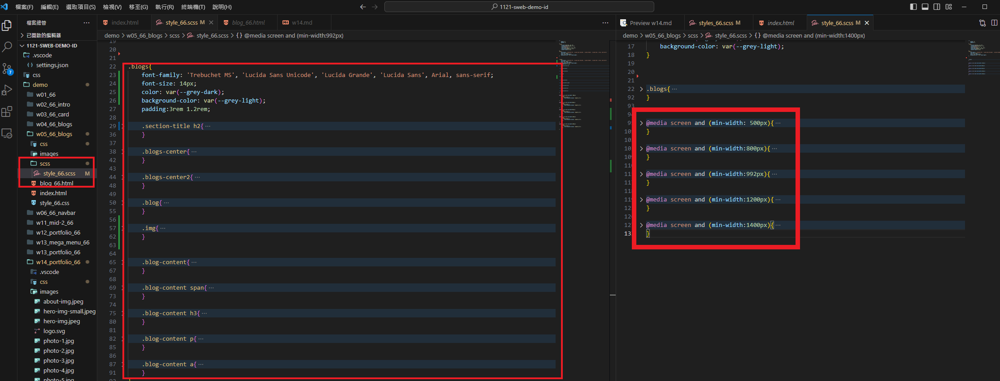

[My github Repo URL](https://github.com/sssn1/1121-sweb-demo-id.git)

### W14-P1: Link from homepage to class demo page, and link back to homepage
 

 

```
d1419fe Sssn1   Fri Dec 15 07:21:27 2023 +0800   W14-P1: Link from homepage to class demo page, and link back to homepage
```

 ### W14-P2: Use new version (7.1.0) of ionicons
 

 


```
8f2e3b9 Sssn1   Fri Dec 15 07:32:26 2023 +0800  W14-P2: Use new version (7.1.0) of ionicons~
```

### W14-P3: Embed W5 blog into portfolio as a section
 

 

 

```
3c3baf1 Sssn1   Fri Dec 15 07:59:37 2023 +0800  W14-P3: Embed W5 blog into portfolio as a section
```

### W14-P4: W14 git logs
 

```
90571be Sssn1   Fri Dec 15 08:02:21 2023 +0800  W14-P4: W14 git logs
3c3baf1 Sssn1   Fri Dec 15 07:59:37 2023 +0800  W14-P3: Embed W5 blog into portfolio as a section
8f2e3b9 Sssn1   Fri Dec 15 07:32:26 2023 +0800  W14-P2: Use new version (7.1.0) of ionicons~
d1419fe Sssn1   Fri Dec 15 07:21:27 2023 +0800   W14-P1: Link from homepage to class demo page, and link back to homepage

```