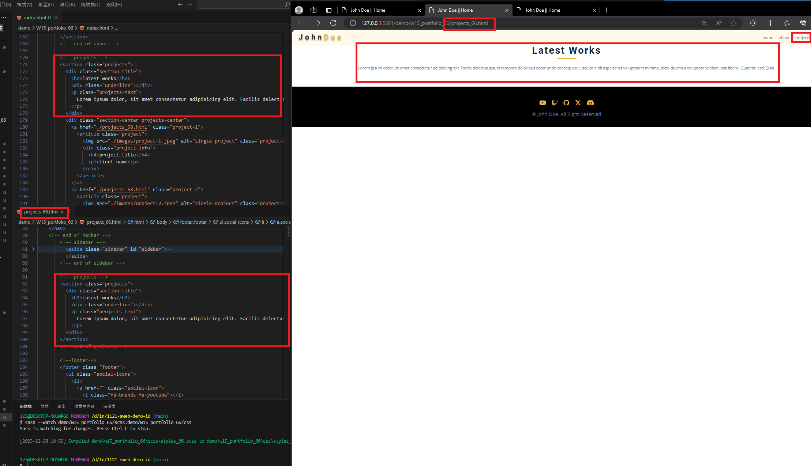
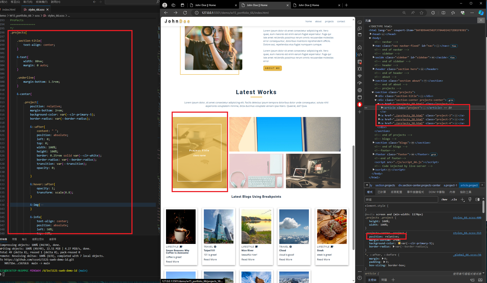
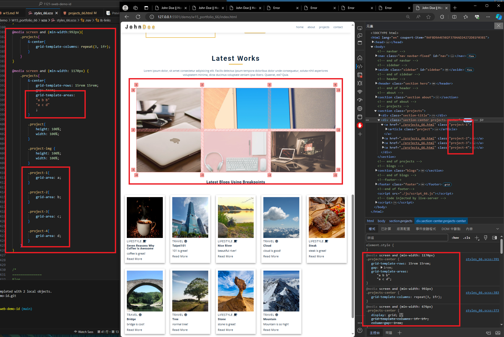
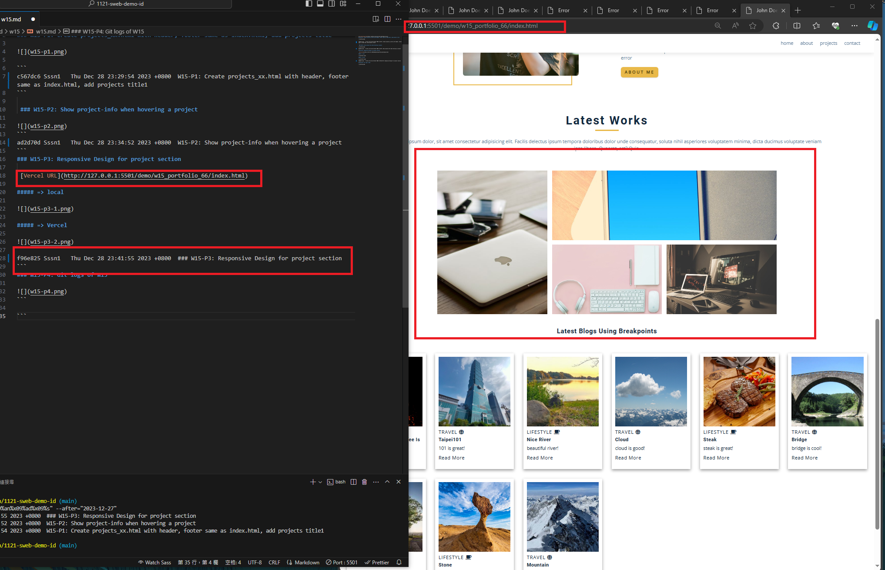
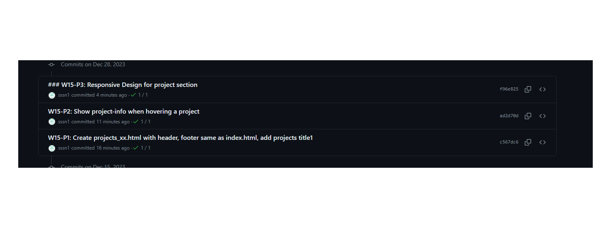

[My github Repo URL](https://github.com/sssn1/1121-sweb-demo-id.git)
### W15-P1: Create projects_xx.html with header, footer same as index.html, add projects title
 

 
```

```

 ### W15-P2: Show project-info when hovering a project
 

```

```
### W15-P3: Responsive Design for project section
 
 [Vercel URL](http://127.0.0.1:5501/demo/w15_portfolio_66/index.html)

##### => local
 

 
##### => Vercel
 

```

```
### W15-P4: Git logs of W15


```

```